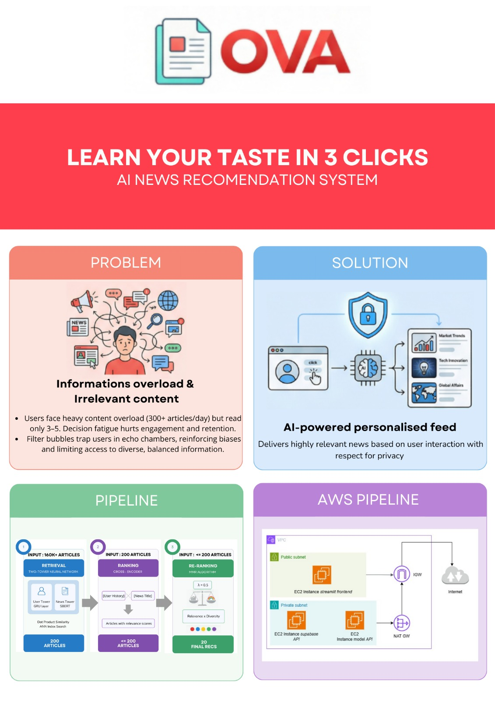

# Session-Based News Recommendation

Modern news readers face massive information overload, making it harder to find relevant content quickly. Existing recommendation methods have major drawbacks: popularity-based systems create filter bubbles, collaborative filtering depends on long-term user tracking, and content-based models lack real personalization.

Our project introduces a session-based news recommendation system using a **Two-Tower architecture with Negative Sampling**, inspired by YouTube's production system. It learns user preferences from just a few clicks, avoiding long-term tracking and improving privacy.

We also apply diversity-aware re-ranking to keep recommendations relevant while reducing filter bubbles. Evaluation is performed on the MIND dataset, measuring performance through NDCG, Recall, and Diversity, alongside qualitative scenarios and production-oriented benchmarks.

## **Project structure**
```
📰 Session-Based-News-Recommendation
├── api                # Backend API endpoints for access to supabase tables
├── data               # Data loaders, preprocessing pipelines, and dataset management
├── frontend           # User-facing interface and interaction logic
├── terraform          # Terraform files for IAC
├── .github/workflows  # Workflow files for CI/CD pipelines (ECR/ECS deployment, data/ml pipeline, terraform infrastructure)
└── ml                 # Machine learning models, training scripts,feature extraction and backend API to serve model results through HTTP
```

## OVA Overview




## Technical Stack

| Area | Technology |
|------|-------------|
| **Data** | NumPy, Pandas, Supabase, SQL|
| **API** | FastAPI |
| **Machine Learning** | TensorFlow, TensorFlow Recommenders, Sentence Transformers |
| **MLOps** | MLFlow, DagsHub |
| **Frontend** | Streamlit |
| **Language** | Python 3.12+ |
| **Deployment** | AWS ECS/ALB |


## **The Team (for the original project, not the MLOps implementation)** 
* **Arthur DELFOSSE** (arthur.delfosse@edu.ece.fr) - Project Lead
* **Tom BALLET** (tom.ballet@edu.ece.fr) - Data Engineer
* **Elise BRUNETON** (elise.bruneton@edu.ece.fr) - Data Engineer
* **Georges HOUMBADJI** (georges.houmbadji@edu.ece.fr) - Lead ML Engineer
* **Ahmed HADI GONI BOULAMA** (ahmed.hadigoniboulama@edu.ece.fr) - ML Engineer
* **Lucas BALBI** (lucas.balbi@edu.ece.fr) - Systems Engineer
